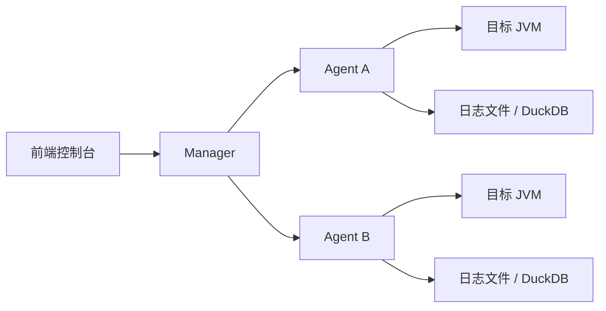

<p align="center">
  
</p>

<p align="center">
  
</p>

<p align="center"><strong>诊断控制台</strong></p>

<p align="center">
  
  
  
  
  
</p>

Huatuo DX 是一个面向测试环境与联调环境的 Java 诊断平台，目标是把节点管理、日志排查、`watch / trace / stack` 诊断、结果沉淀放进一个统一控制台里，减少命令行临时排障的来回切换成本。

## 功能概览

- 节点注册、心跳、在线状态管理
- 本机伴生 Agent 自动拉起、状态识别、手动重启
- Java 进程发现、可见进程勾选、执行时按节点与进程选择目标
- 诊断规则管理
- `watch`、`trace`、`stack` 三种规则类型
- 配置方式 / 脚本方式双向切换
- 诊断记录留存、结果详情页、按类型结构化渲染
- 日志源管理
- 查询模式 / 采集模式双模式日志能力
- DuckDB 日志索引加速查询
- 跟随模式 SSE 流式追加
- 日志上下文展开、命中行高亮、终端式日志工作台

## 项目结构

```text
huatuo-dx/
├── backend/
│   ├── manager/   # 管理服务
│   └── agent/     # 节点 Agent
├── frontend/      # 控制台前端
└── README.md
```

### 管理服务

`backend/manager`

- 节点注册与心跳接入
- 节点配置、日志源配置、伴生 Agent 管理
- 诊断规则管理与分发
- 诊断记录保存与详情查询
- 统一异常包装与结果返回

### 节点 Agent

`backend/agent`

- 目标 Java 进程发现
- 诊断引擎检测、安装、附着执行
- `watch / trace / stack` 命令执行与监控会话维护
- 日志查询模式直查文件
- 日志采集模式增量采集 + DuckDB 索引

### 前端控制台

`frontend`

- 管理端
  - 本地节点
  - 诊断规则
  - 诊断记录
- 用户端
  - 日志查询
  - 诊断规则
  - 诊断记录

## 诊断能力

### 1. Watch

适合看方法入参、返回值、异常、对象展开结果。

- 支持输出表达式配置
- 支持条件表达式
- 支持 `-x` 展开层级
- 支持匹配次数、超时
- 结果按“第 n 次命中”结构化展示

### 2. Trace

适合看调用链耗时与慢节点。

- 支持 `--skipJDKMethod`
- 支持条件表达式、匹配次数、超时
- 结果按“第 n 次链路”展示
- 每次链路都拆成耗时节点，不再只看原始终端文本

### 3. Stack

适合看方法调用堆栈与异常来源。

- 支持 `stack class method` 规则
- 支持配置方式 / 脚本方式互转
- 结果按“第 n 次堆栈”展示
- 会把入口方法、`Caused by`、栈帧、折叠提示拆开渲染

### 4. 共享监控与订阅

为了避免多个用户对同一个类/方法/进程重复启动监控而互相干扰，Huatuo DX 对底层监控会话做了复用。

- 同一个监控源只启动一个底层会话
- 不同用户可以各自拥有自己的诊断记录
- 多条诊断记录可以共享同一个底层 `sessionId`
- 记录列表与详情页会显示共享标识和当前订阅人数
- 用户停止自己的记录时，只会停止自己的订阅
- 只有最后一个订阅者停止后，才会真正停止底层监控

监控源是否相同，按以下维度判断：

- 节点
- 目标进程 PID
- 诊断类型
- 类匹配
- 方法匹配
- 条件表达式
- 输出表达式
- 命令选项
- 匹配次数
- 超时时间

## 日志能力

每条日志源都可以独立配置。

### 查询模式

- 默认模式
- 不做本地采集入库
- 查询时直接读取目标日志文件
- 适合低频排查与节省存储

### 采集模式

- Agent 增量采集日志
- 写入 DuckDB 索引库
- 适合高频检索与跟随查看
- 可查看采集文件数、采集行数、最近采集时间

### 日志查询体验

- 节点 / 日志源左侧树形列表
- 暗色终端工作台
- 关键词查询
- 跟随模式
- 上下文展开
- 命中行与上下文命中高亮

## IDEA 插件

项目内置了一个 IntelliJ IDEA 插件模块，可在 Java 方法上直接右键创建诊断规则。

目录：

- `idea-plugin`

能力：

- 在方法上右键快速创建 `watch / trace / stack` 规则
- 自动识别当前类名与方法名
- 创建前弹出规则名称输入框
- 支持配置默认 Java 进程显示名
- 请求会先走插件独立登录，再附带签名验签调用 manager 接口

### 插件设置

安装插件后，可在以下位置找到配置：

- `设置 -> 其他设置 -> Huatuo Diagnose`
- `工具 -> 华佗诊断设置`

需要填写：

- 服务端地址
- 用户名
- 密码
- 访问密钥
- 签名密钥
- 默认 Java 进程显示名

### 插件打包

```bash
cd idea-plugin
./gradlew buildPlugin
```

生成的 zip 位于：

- `idea-plugin/build/distributions`

安装方式：

1. 打开 IDEA
2. 进入 `设置 -> 插件`
3. 右上角齿轮选择 `Install Plugin from Disk...`
4. 选择生成的 zip 安装

## 架构说明



核心链路：

1. Agent 注册到 Manager，并定期发送心跳。
2. Manager 保存节点、日志源、规则与诊断记录。
3. 规则不绑定节点，执行时才选择目标节点和 Java 进程。
4. Agent 在执行时按目标进程附着诊断引擎。
5. 日志查询按日志源模式分流到“直查”或“DuckDB 索引查询”。

## 技术栈

### 后端

- Java 17
- Spring Boot 3
- Spring Web
- Spring Data JPA
- H2
- DuckDB

### 前端

- React 18
- TypeScript
- Vite 4
- Tailwind CSS
- Ant Design

## 快速开始

### 1. 启动 Manager

```bash
mvn -f backend/pom.xml -pl manager spring-boot:run
```

默认端口：

- `8081`

### 2. 启动 Agent

```bash
mvn -f backend/pom.xml -pl agent spring-boot:run
```

默认端口：

- `8090`

### 3. 启动前端

```bash
cd frontend
npm install
npm run dev
```

默认端口：

- `5173`

## 运行要求

### 后端

- JDK 17+

### 前端

- Node.js 16.x

> 当前 `codex/node16-compat` 分支前端已切到 Vite 4，可直接在 Node 16 环境下安装与构建。

## 当前已实现状态

- 管理端 / 用户端双入口
- 标准路由切换
- 节点管理表格化
- 伴生 Agent 管理
- 可见进程控制
- 日志源独立配置
- 查询模式 / 采集模式
- 诊断规则详情页
- 诊断记录详情页
- 诊断结果结构化渲染
- 统一结果包装与全局异常处理

## 开发说明

### 前后端验证

后端：

```bash
mvn -Dmaven.repo.local=$(pwd)/.m2 -f backend/pom.xml test
```

前端：

```bash
cd frontend
npm install
npm run build
```

## License

本项目基于 [MIT License](./LICENSE) 开源。
